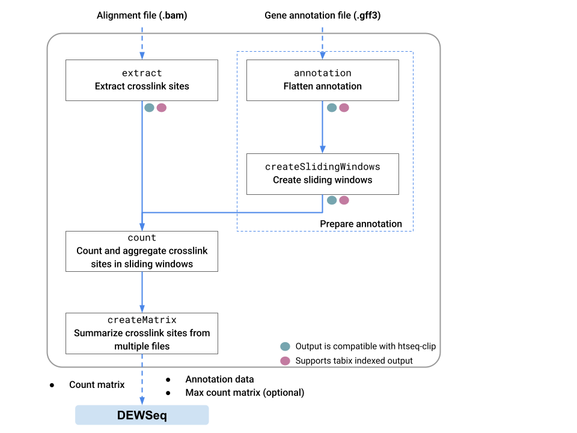

.. Shoji documentation master file, created by
   sphinx-quickstart on Mon Jul 14 09:01:54 2025.
   You can adapt this file completely to your liking, but it should at least
   contain the root `toctree` directive.

Shoji
=====

Shoji is a toolset for the analysis of eCLIP/iCLIP datasets, designed to be a flexible replacement for `htseq-clip`_ package. 
This python package can be used to generate files necessary for  data analysis using the companion R/Bioconductor package `DEWSeq`_

   
   Shoji data flow

Differences to htseq-clip
--------------------------
* Flag ``--splitExons`` is removed, Shoji cannot split exons into components
* Flag ``--split-intron`` is added. If an intron overlaps exon from another gene, using this tag will split the intron into non overlapping chunks
* Piping output disabled. Output file names MUST be specified
* ``count`` function writes output files in `Apache parquet`_ file format

.. _`htseq-clip`: https://htseq-clip.readthedocs.io/en/latest/
.. _`DEWSeq`: https://bioconductor.org/packages/release/bioc/html/DEWSeq.html
.. _`Apache parquet`: https://parquet.apache.org/

.. toctree::
   :maxdepth: 2
   :caption: Contents:

   overview
   installation
   documentation

`Hentze lab`_, EMBL Heidelberg

.. _`Hentze lab`: https://www.embl.org/groups/hentze/

